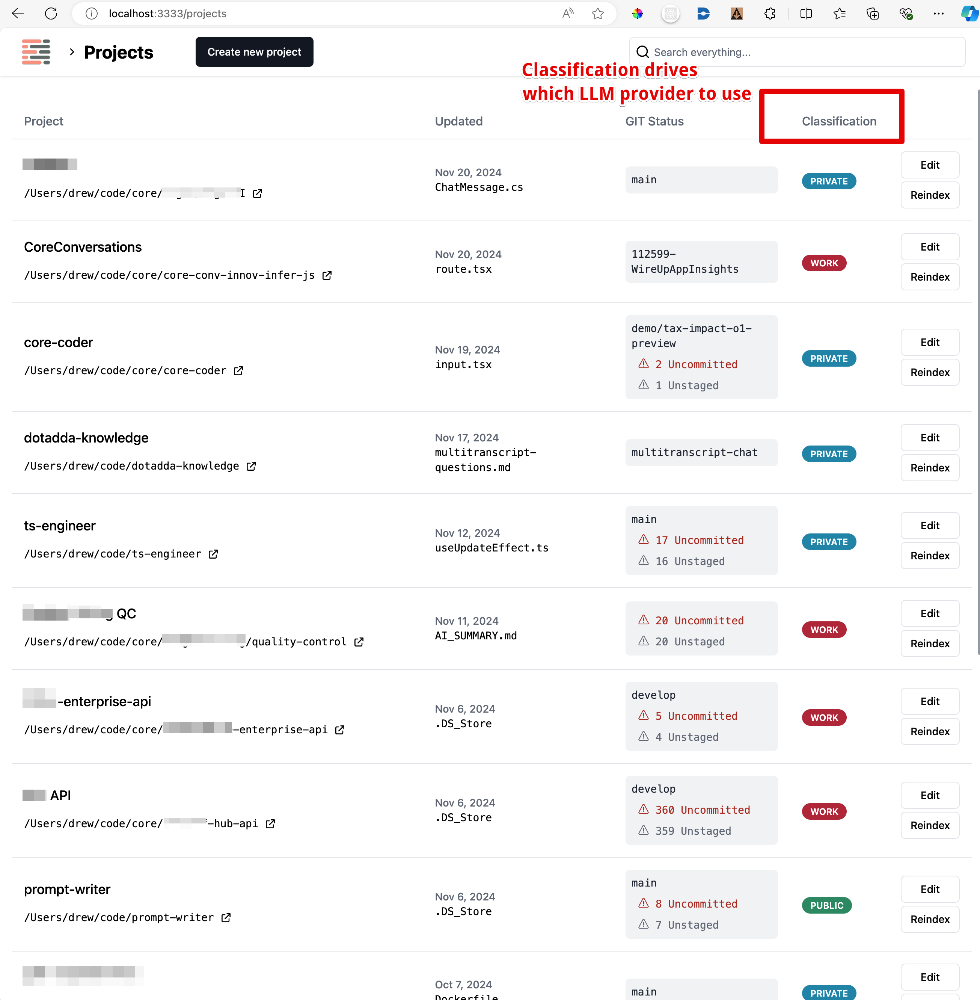
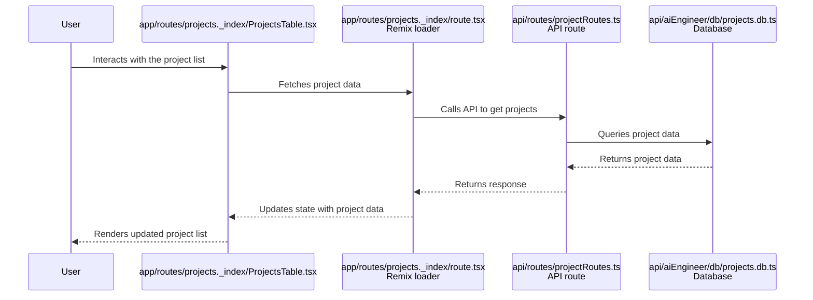
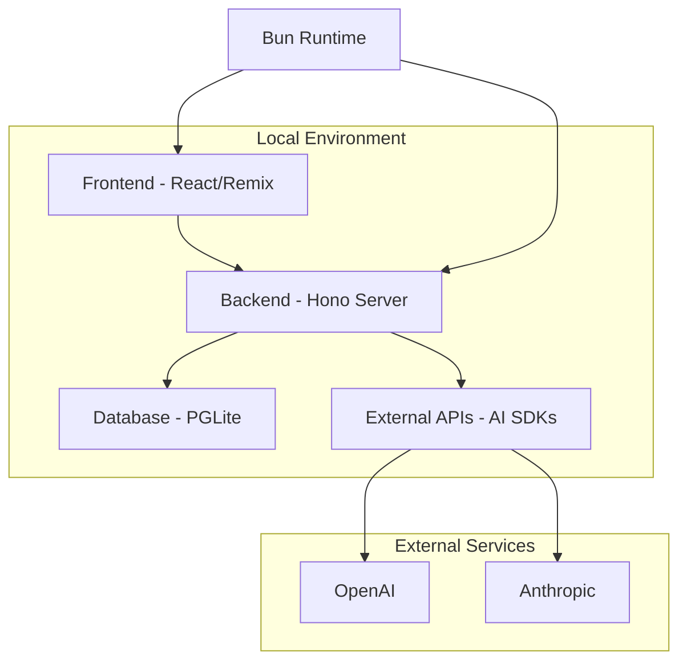

# AI Engineer

This is a tool I'm building for myself to:

- be a fun way to experiment with new AI techniques
- create a AI Coding Assistant that is hyper tailored to my preferences and working style

It only runs locally and directly reads and writes files on my files system.

- It can do [cool stuff](##Cool-Stuff) like:
  - Hybrid search (fulltext search + semantic search) for code across all of my projects
  - Chat with my code
  - Generate documentation with code snippets and diagrams
  - Automatically do basic/intermediate coding tasks for me
    - I enter the raw task description
    - It generates specifications and requirements
    - Then it writes a coding plan
    - Then it uses apple script to lauch the project in Cursor and execute the Coding Plan using Cursor Composer.
  - Surgical context selection
    - Using the file explorer, I can select files and my selection is automatically concatenated into single giant block of markdown containing the file contents. Perfect for then pasting into ChatGPT or Claude or any other third party tool.

## Cool Stuff

### Chat with your codebase

- Context selections can be manual or automatic
- Supports rendering Mermaid diagrams, chartjs charts, and syntax highlighted code blocks.
- Great for getting familiar with a codebase or documenting a new feature.

### AI Powered Code Tasks

1. Enter a raw task description
2. AI will classify the task as feature, bug, documentation, refactor, etc...
3. Based on the work item type, it will use a predefined template to generate a detailed task specification.
4. Manually edit and tweak the specification
5. Generate an a coding plan
   1. Coding plan is syntax highlighted with a special diff syntax to help understand the changes
   2. There is a **Apply in Cursor** button that will launch the project in Cursor and execute the Coding Plan using Cursor Composer.

### Surgical context selection

A custom [File Explorer](app/toolkit/components/FileExplorer/FileExplorer.tsx) allows me to manually select exactly which files I want to use as context for my Chat, Coding Task.

- I can see exactly how many tokens I have selected.
- The selection is automatically used for Chat and Coding Tasks
- The active selection is always concatenated into single giant block of markdown containing the file contents. Perfect for then pasting into ChatGPT or Claude or any other third party tool.

> [!NOTE]
> if there are no files selected, the AI will dynamically choose which files are relevant via a mixture of vector search and parsing the file tree.

### Project classification for model selection

> Azure OpenAI vs OpenAI vs Anthropic vs Deepseek vs Groq vs Gemini etc...

We can decide based on the privacy classifcation of the project. For example, work projects get routed through my company's Azure OpenAI instance.

## Tech Stack

| **Name**                                                   | **What is it?**                                                                                    |
| ---------------------------------------------------------- | -------------------------------------------------------------------------------------------------- |
| [React](https://www.npmjs.com/package/react)               | A JavaScript library for building user interfaces.                                                 |
| [Remix](https://www.npmjs.com/package/@remix-run/react)    | A framework for building React applications with server-side rendering.                            |
| [Bun](https://www.npmjs.com/package/bun)                   | A fast JavaScript runtime like Node.js.                                                            |
| [Hono](https://www.npmjs.com/package/hono)                 | A small, simple, and ultrafast web framework for the Edge.                                         |
| [OpenAI](https://www.npmjs.com/package/openai)             | A library for interacting with OpenAI's API.                                                       |
| [Langfuse](https://www.npmjs.com/package/langfuse-vercel)  | A tool for managing and visualizing AI model telemetry.                                            |
| [Shiki](https://www.npmjs.com/package/shiki)               | A syntax highlighter for code blocks.                                                              |
| [Zod](https://www.npmjs.com/package/zod)                   | A TypeScript-first schema declaration and validation library.                                      |
| [Chart.js](https://www.npmjs.com/package/chart.js)         | A simple yet flexible JavaScript charting library.                                                 |
| [Day.js](https://www.npmjs.com/package/dayjs)              | A lightweight JavaScript date library for parsing, validating, manipulating, and formatting dates. |
| [Lucide React](https://www.npmjs.com/package/lucide-react) | A library of simple and consistent icons for React.                                                |
| [Madge](https://www.npmjs.com/package/madge)               | A tool for generating visualizations of module dependencies.                                       |

## Project Structure

| Path                | Purpose                                                                |
| ------------------- | ---------------------------------------------------------------------- |
| /api                | Contains server-side logic, including API endpoints and middleware.    |
| /api/aiEngineer/api | Houses API-related functionalities for AI engineering tasks.           |
| /api/aiEngineer/db  | Database-related files, including schema definitions and migrations.   |
| /api/aiEngineer/fs  | File system utilities for handling project files and directories.      |
| /api/aiEngineer/llm | Logic for interacting with large language models (LLMs).               |
| /api/routes         | Defines the routing for various API endpoints.                         |
| /api/telemetry      | Telemetry and logging functionalities for monitoring and diagnostics.  |
| /app/routes         | Frontend routes for the application, organized by feature.             |
| /app/toolkit        | Utility functions and components shared across the application.        |
| /tasks              | Scripts for various development tasks, such as migrations and backups. |

## Screens

| Name               | Route (Path & Filename)                                                            | Purpose                                                  |
| ------------------ | ---------------------------------------------------------------------------------- | -------------------------------------------------------- |
| Home               | `/` `app/routes/_index.tsx`                                                    | Redirects to the projects page.                          |
| Projects           | `/projects` `app/routes/projects._index/route.tsx`                             | Displays a list of projects.                             |
| New Project        | `/projects/new` `app/routes/projects.new.tsx`                                  | Allows users to create a new project.                    |
| Project Details    | `/projects/:id` `app/routes/projects.$id/route.tsx`                            | Displays details of a specific project.                  |
| Project Summary    | `/projects/:id/summary` `app/routes/projects.$id.summary/route.tsx`            | Shows a summary of the project.                          |
| Project Chat       | `/projects/:id/chat` `app/routes/projects.$id.chat._index/route.tsx`           | Allows users to chat about the project.                  |
| Project Code Tasks | `/projects/:id/codeTasks` `app/routes/projects.$id.codeTasks._index/route.tsx` | Displays code tasks related to the project.              |
| Project Edit       | `/projects/:id/edit` `app/routes/projects.$id.edit/route.tsx`                  | Allows users to edit project details.                    |
| File Viewer        | `/projects/:id/file-viewer` `app/routes/projects.$id.file-viewer.tsx`          | Displays the contents of a specific file in the project. |
| Markdown Viewer    | `/projects/:id/markdown` `app/routes/projects.$id.markdown.tsx`                | Shows a markdown view of selected files.                 |
| Global Search      | `/search` `app/routes/search/route.tsx`                                        | Provides a global search functionality across projects.  |

## Data Fetching

The project utilizes Remix for both server-side rendering and client-side interactions. Data fetching is handled through API routes defined in the `api/routes` directory. These routes interact with the database using a custom database layer built on `pglite`.

### UI to Backend Connection

1. **Client-Side Fetching**: Components in the `app/routes` directory use Remix's `useLoaderData` and `useActionData` hooks to fetch data from the server. For example, the `ProjectsTable` component fetches project data from the server and displays it in a table format.

2. **Server-Side Rendering**: Remix handles server-side rendering for initial data fetching. The server processes requests and returns pre-rendered HTML to the client, which is then hydrated with client-side JavaScript.

3. **Database Access**: The backend interacts with the database through the `db` module in `api/aiEngineer/db`. This module provides functions to query and manipulate data in the database.

4. **No Authentication Provider**: The codebase does not explicitly mention any authentication provider integration.

### Step-by-Step Walkthrough of a Typical User Request

1. **User Interaction**: A user interacts with the UI, such as clicking a button or submitting a form.
2. **Client-Side Request**: The client-side component uses Remix's hooks to send a request to the server.
3. **Server-Side Processing**: The server receives the request and processes it using the appropriate API route.
4. **Database Query**: The API route interacts with the database to fetch or update data.
5. **Response to Client**: The server sends the response back to the client, which updates the UI accordingly.

### Sequence Diagram

## Architecture

- **Frontend - React/Remix**: The client-side application is built using React and Remix, providing a modern web interface. It is hosted on the user's machine and interacts with the backend server via HTTP requests.
- **Backend - Hono Server**: The server-side application is built using the Hono framework, handling API requests and serving the frontend. It is hosted on the user's machine and connects to the database and external APIs.
- **Database - PGLite**: A SQLite-like database is used for storing project data, code tasks, and conversations. It is hosted locally and accessed by the backend server for data persistence.
- **External APIs - AI SDKs**: The application integrates with external AI services like OpenAI and Anthropic for generating code and answers. These services are accessed via their respective SDKs and APIs.
- **Bun Runtime**: The project uses Bun as the runtime for executing scripts and running the server, providing a fast and efficient environment for development and production.

